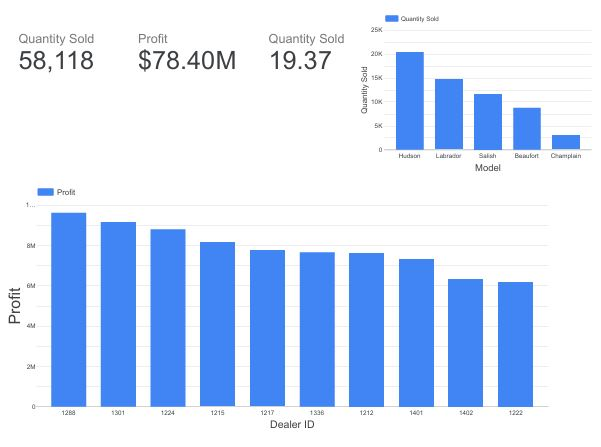

# 📊 Looker Studio Analytics Portfolio

Welcome to my portfolio of interactive dashboards created using **Google Looker Studio**. These projects showcase my ability to transform raw datasets into actionable insights using clear KPIs, effective visualizations, and data storytelling techniques.

Each dashboard is built with real-world scenarios in mind — focusing on business objectives, stakeholder reporting, and visual clarity.

---

## 🔹 Projects Included

### 🚗 Car Sales & Service Dashboard
**Objective:** Analyze KPIs across sales and after-sales service for a car dealership.  
**Highlights:**
- Sales KPIs: Profit, Quantity Sold, Dealer-wise Profit, Avg. Units Sold
- Service KPIs: Recalls by Model, Sentiment Analysis, Monthly Trends
- Charts: Bar, Column, Treemap, Combo Line, Pivot Heatmap  
📁 [`/car-sales-service-dashboard`](./car-sales-service-dashboard)

  

---

### 📌 More dashboards coming soon!
- Marketing Campaign Performance
- E-commerce Sales Trends
- Customer Retention & Churn Analysis
- ...and more

---

## 🛠 Tools Used
- Google Looker Studio
- Google Sheets / Excel
- CSV & Excel Data Sources
- KPI & BI Visualization Techniques

---

## 💼 About Me
I'm a data professional focused on turning data into insight through clean, impactful dashboards. Currently upskilling in Business Intelligence and Data Engineering.

### 📬 Connect with Me
Feel free to connect for feedback, improvements, or collaboration opportunities.
- 💼 [LinkedIn](https://www.linkedin.com/in/eegapuri-lokeshwar-reddy-281327308)
- 💻 [Website](https://elreddy-portfolio.lovable.app)
- 📧 Email: elokesh4292@gmail.com

